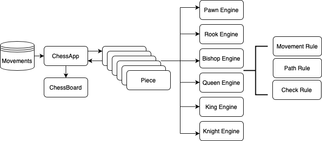

# ScalaChess
## Chess GUI written in Scala


# 
This is being written as a Scala learning exercise. I am particularly interested in
suggestions on how the code can be made more functional and generally adopt a more
Scala orientated approach instead of the current Javaesque style.

This project is written using TDDD - TODO Driven Design.


Each Movement use a Piece which contains an Engine with the rules of how it can move through the board, and also if each move end up in a Check or Checkmate.


## How to run


There will be two ways to currently run ```Scala Chess```, by **Docker** or **Makefile**

### Docker

tbd

### Makefile

To being able to build and run this project, it will require you have `````sbt````` installed.

I create a **Makefile** to add all the option to interact with the platform:

* **clean:** Clean all the resources in the target folder.
* **test** Run all the testing pyramid
* **build:** Build the jar using assembly.
* **run-game:** Run the chess game passing a path where we have a file with the chess movements, and the
    chess clock to wait between each player movement

````
Makefile clean|test|build|run-game
````
